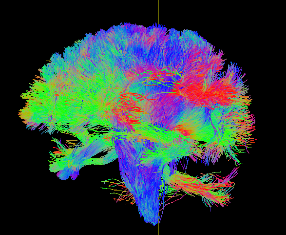

# FastCod

This repo is the official implementation of paper: [FastCod: Fast Brain Connectivity in Diffusion Imaging](https://arxiv-export3.library.cornell.edu/abs/2302.09247)
This paper won the **best student paper runner-up award** in SPIE-MI 2023!

**FastCod: Your Time-saving Beacon for Brain Connectivity**: 
FastCod is a cutting-edge tool designed to rapidly compute diffusion-based connectivity features between brain regions. Developed as an open-source tool in Python, it presents an indispensable asset for researchers and professionals employing diffusion-weighted MRI and tractography.

Key features:

- **Superior Speed**: Experience over 30x speedup in connectivity computations against traditional methods.
- **Server Compatibility**: Designed for command line execution, optimizing server interactions.
- **Super-resolve ability**: Even when working with low-resolution dMRI (e.g., 2mm), FastCod ensures high-resolution connectivity outputs.


# How to use

There are currently three modes that you can run FastCod
- Mode 1 Take raw diffusion image (and bvec, bval) as input.
- Mode 2 For users with an existing FOD image, which serves as the input.
- MODE 3 Tailored for data organized in accordance with the HCP dataset structure.

Both native environments and the singularity container ([Download here]()) are supported for running FastCod. 

Useful commands and detailed explanations for each mode are provided in the subsequent sections.


```shell
# check function help doc
singularity run -e -B /mnt fastcod.sif run_ConnectivityAnalysis.py --help
singularity run -e -B /mnt fastcod.sif prepare_src_trg.py --help

# run MODE 1
singularity run -e -B /mnt fastcod.sif prepare_src_trg.py --seg_type slant --fseg path/to/slant.nii.gz --dout path/to/output/folder

singularity run -e -B /mnt fastcod.sif run_ConnectivityAnalysis.py \
  --fdimg path/to/DWI_proc.nii \
  --fbvec path/to/DWI_proc.bvecs \
  --fbval path/to/DWI_proc.bvals \
  --dout path/to/output/folder \
  --fsrc_mask path/to/src_mask.nii.gz \
  --ftrg_seg path/to/trg_seg.nii.gz \
  --fbrainmask path/to/brainmask.nii.gz

# run MODE 2
singularity run -e -B /mnt fastcod.sif run_ConnectivityAnalysis.py \
  --fFOD path/to/wmfod.nii.gz \
  --dout path/to/output/folder \
  --fsrc_mask path/to/src_mask.nii.gz \
  --ftrg_seg path/to/trg_seg.nii.gz \
  --fbrainmask path/to/brainmask.nii.gz

```

## MODE 1

- Step 1 [optional]: Prepare source ROI and target ROI. Here we take thalamus mask as source ROI and cortical parcellations
as target ROI. If you already have your src and trg ROI, you can skip this step and directly go to step 2.
```shell
python src/prepare_src_trg.py --seg_type slant --fseg data/mtbi_demo/slant.nii.gz --dout data/mtbi_demo/conn
```
Currently, we only support segmentation from [SLANT label](https://github.com/MASILab/SLANTbrainSeg/blob/master/BrainColorLUT.txt).

-[ ] TODO: The freesurfer recon-all segmentation result is not supported yet.


- Step 2 run connectivity analysis. With source and target ROI on hand, you can run the connectivity analysis.
```shell
python src/run_ConnectivityAnalysis.py \
  --fdimg data/mtbi_demo/DWI_proc.nii \
  --fbvec data/mtbi_demo/DWI_proc.bvecs \
  --fbval data/mtbi_demo/DWI_proc.bvals \
  --dout data/mtbi_demo/conn \
  --fsrc_mask data/mtbi_demo/conn/tha_mask.nii.gz \
  --ftrg_seg data/mtbi_demo/conn/slant6_trg_mask.nii.gz \
  --fbrainmask data/mtbi_demo/robex.nii.gz
  [options]
```


## MODE 2

If you already have your FOD image, you can do
```shell 
python src/run_ConnectivityAnalysis.py \
  --fFOD data/mtbi_demo/conn/wmfod.nii.gz \
  --dout data/mtbi_demo/conn \
  --fsrc_mask data/mtbi_demo/conn/tha_mask.nii.gz \
  --ftrg_seg data/mtbi_demo/conn/slant6_trg_mask.nii.gz \
  --fbrainmask data/mtbi_demo/robex.nii.gz
  [options]
```


## MODE 3

1. set up IO path. There are two options (either one is fine):
   1. modify the `config.yaml` file in the `conf` folder.
   2. assign the path in the command line. For example, see step 2.

your input folder `din` should have the following structure, which is similiar to Human Connectome Project dataset:
```shell
├── 991267
│   ├── T1w
│   │   ├── 991267 # freesurfer's recon-all output folder
│   │   ├── aparc.a2009s+aseg.nii.gz # Destrieux atlas-based cortical parcellation
│   │   ├── aparc+aseg.nii.gz # Desikan-Killiany atlas-based cortical parcellation
│   │   ├── brainmask_fs.nii.gz
│   │   ├── Diffusion # diffusion image folder
│   │   │   ├── bvals # bval file
│   │   │   ├── bvecs # bvec file
│   │   │   ├── data.nii.gz # dwi data (should already be eddy and distortion corrected)
│   │   │   └── nodif_brain_mask.nii.gz

```
Note: It's okay to have extra irrelavant files here and there than specified above. The code will just ignore them.

2. run the command in the terminal:
```shell
# din = data input, dout = data output, subid = subject id
python src/ConnectivityAnalysisHCP.py io.din=HCP/991267 io.dout=data/991267/run1 io.subid=991267
```
3. check the results in the `io.dout` folder. If you run this successfully, you should be able to see following files:
```shell
data/
└── 991267
    └── run1
        ├── cache
        ├── cortical_bimask.nii.gz
        ├── debug.log
        ├── Desikan_lut.csv
        ├── Desikan_passthromap_fsparc.nii.gz # can visualize with Freesurfer:freeview and load Freesurfer's lookup table: FreeSurferColorLUT.txt
        ├── Desikan_passthromap_fsparc_rgb.nii.gz
        ├── Desikan_passthromap.nii.gz # fiber density map
        ├── Desikan_passthromap_parc.nii.gz # the parcellation results
        ├── Desikan_target_parc.nii.gz # the target cortical regions for parcellation
        ├── tha_bimask.nii.gz
        ├── tha_mask.nii.gz
        └── tracts.tck # tractography results

```

# Options
For **run_ConnectivityAnalysis.py**, you can use the following options:
```shell
run_ConnectivityAnalysis.py [-h] --dout DOUT --fsrc_mask FSRC_MASK --fbrainmask FBRAINMASK --ftrg_seg FTRG_SEG [--fdimg FDIMG] [--fbvec FBVEC]
                                   [--fbval FBVAL] [--fFOD FFOD] [--exp_mode] [--tr_select TR_SELECT] [--tr_alg {iFOD2,iFOD1,SD_STREAM,Tensor_Det,Tensor_Prob}]
                                   [--normalize_by_area NORMALIZE_BY_AREA] [--bvec_flip {x,y,z}] [--down_res DOWN_RES] [--tr_dilate_src TR_DILATE_SRC]
                                   [--tr_dilate_trg TR_DILATE_TRG]

   --dout DOUT           Output directory
   
   --fsrc_mask FSRC_MASK
                        Source mask file path
                        
   --fbrainmask FBRAINMASK
                        Brain mask file path
                        
   --ftrg_seg FTRG_SEG   Target segmentation file path
   
   --fdimg FDIMG         Input diffusion image file path
   
   --fbvec FBVEC         b-vector file path
   
   --fbval FBVAL         b-value file path
   
   --fFOD FFOD           FOD image file path
   
   --exp_mode            Experiment mode
   
   --tr_select TR_SELECT
                        number of streamlines
                        
   --tr_alg {iFOD2,iFOD1,SD_STREAM,Tensor_Det,Tensor_Prob}
                        tracing algorithm
                        
   --normalize_by_area NORMALIZE_BY_AREA
                        whether normalize counts by area of target region
   
   --bvec_flip {x,y,z}   Flip b-vector in x,y,z direction
   
   --down_res DOWN_RES   the target of downsampled resolution. This option only works when input is raw diffusion image
   
   --tr_dilate_src TR_DILATE_SRC
                        Dilate source mask? If so, by how many voxels
   
   --tr_dilate_trg TR_DILATE_TRG
                        Dilate target mask? If so, by how many voxels

```

For **prepare_src_trg.py**, you can use the following options:
```shell
prepare_src_trg.py [-h] --seg_type {slant,freesurfer} --fseg FSEG --dout DOUT
  
   --seg_type {slant,freesurfer}
   
   --fseg FSEG           segmetation file path
   
   --dout DOUT           Output directory
```


# Quality Assurance Checklist
1. Check the orientation of your diffusion image. An easy way to check is to see if your tract.tck (the tractography) looks normal or not. An normal looking tractography should look like this:



An abnormal tracts could look like very different, for exmaple, something like this:


To debug, try to flip the bvec in x, y, or z direction. For example, if you want to flip in z direction, you can add
`--bvec_flip z`, for example:
```shell
singularity run -e -B /mnt fastcod.sif run_ConnectivityAnalysis.py \
  --fdimg path/to/DWI_proc.nii \
  --fbvec path/to/DWI_proc.bvecs \
  --fbval path/to/DWI_proc.bvals \
  --dout path/to/output/folder \
  --fsrc_mask path/to/src_mask.nii.gz \
  --ftrg_seg path/to/trg_seg.nii.gz \
  --fbrainmask path/to/brainmask.nii.gz \
  --bvec_flip z
```

# How to cite
If you find this is useful for your research, please cite our paper:

```bibtex
@article{bian2023fastcod,
  title={FastCod: Fast Brain Connectivity in Diffusion Imaging},
  author={Bian, Zhangxing and Shao, Muhan and Zhuo, Jiachen and Gullapalli, Rao P and Carass, Aaron and Prince, Jerry L},
  journal={arXiv preprint arXiv:2302.09247},
  year={2023}
}
```

# Contact
If you have any questions, please contact us at jasonbian.zx@gmail.com

[Under Construction] For tutorial, blogs, and more information, please visit our [project page](https://jasonbian97.github.io/fastcod/)
